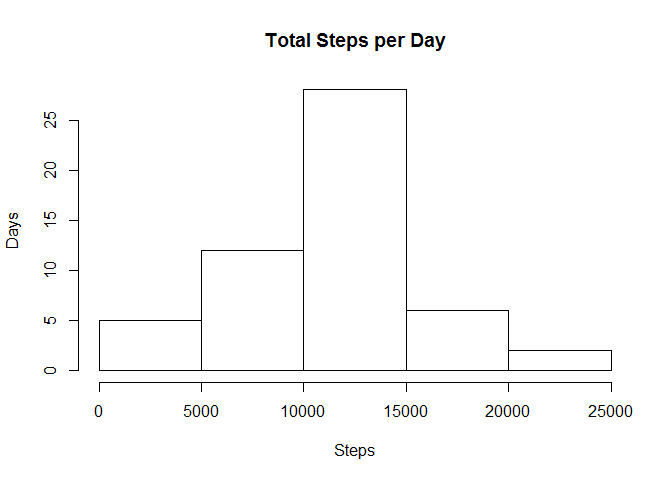
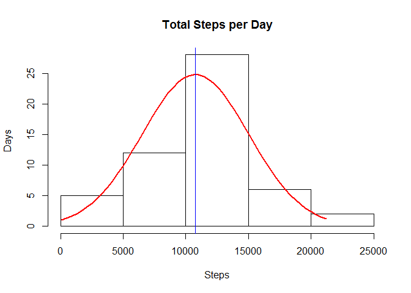
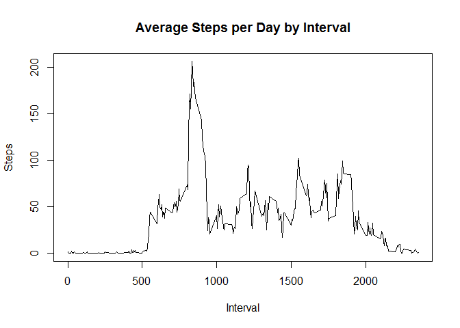
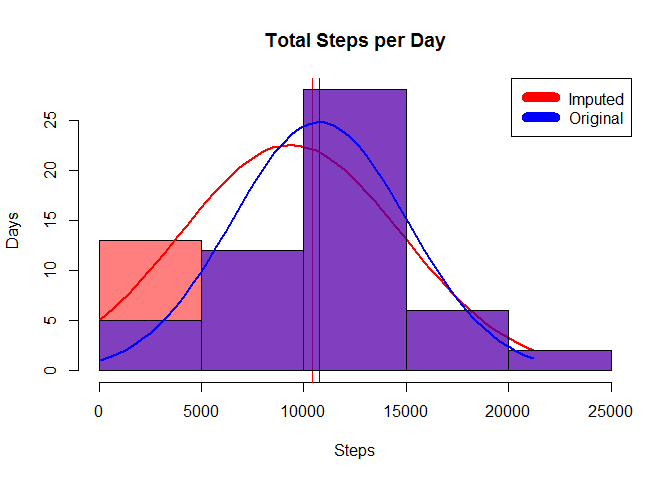
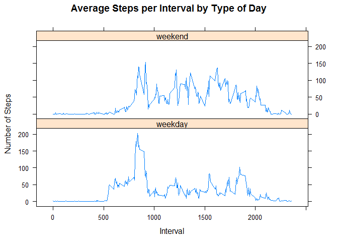

# Reproducible Research: Peer Assessment 1
J.E.Black  
April 2, 2016  

# Reproducible Research: Week01: Project 1: Movement

## Assignment:

Given the project data provided as a single zip file at:  
"https://d396qusza40orc.cloudfront.net/repdata%2Fdata%2Factivity.zip"

Containing one data file: 

  - activity.csv

Analyze the data and answer the questions detailed below.

## Loading and preprocessing the data

### Initialize primary variables:


```r
# set known path & file names
#
hpath <- getwd() # save our spot
upath <- "https://d396qusza40orc.cloudfront.net/repdata%2Fdata%2Factivity.zip"
dname <- "RepData_PeerAssessment1"
ztemp <- "temp.zip"
fname <- "activity.csv"

dpath <- file.path(hpath, dname)
```

### Initialize the directory structure


```r
# Make sure the working directory is there
if (!file.exists(dpath)){ dir.create(dpath) }
setwd(dpath) # go there
```

### Initialize the Datafile

```r
# Check if the data is downloaded and download when applicable
if (!(file.exists(fname))) {
  download.file(upath, destfile = ztemp)
  unzip(ztemp)
  file.remove(ztemp)
  }

if (!(file.exists(fname))) { stop("Failed to download dataset") }
```

### Read the Data


```r
# read the activity data from the CSV file
aData <- read.csv(fname)
```

## Q: What is mean total number of steps taken per day?

For this step, the missing values in the dataset may be ignored.

  1 Calculate the total number of steps taken per day
  

```r
totalStepsPerDay <- aggregate(steps ~ date, aData, sum)
```
  2 Make a histogram of the total number of steps taken each day.
  

```r
x <- totalStepsPerDay$steps
h <- hist(x, ylab="Days", xlab="Steps",freq=TRUE, main="Total Steps per Day")
```


  
  3 Calculate and report the mean and median of the total number of steps taken per day


```r
x <- totalStepsPerDay$steps
h <- hist(x, ylab="Days", xlab="Steps",freq=TRUE, main="Total Steps per Day")

xMean <- mean(x)
xMedian <- median(x)

xfit<-seq(min(x),max(x),length=length(x)) # set width
yfit<-dnorm(xfit,mean=xMean,sd=sd(x))
yfit <- yfit*diff(h$mids[1:2])*length(x)
lines(xfit, yfit, col="red", lwd=2) 

abline(v=median(totalStepsPerDay$steps),col="blue")
```



The mean is: 1.0766189\times 10^{4} and the median is 10765.

Since they are so close to being equal, I have shown 
them on the plot,  
with the mean at the peak of the normal curve in red,  
and the median at the vertical line in blue.  


## Q: What is the Average Daily Activity Pattern?

  - Calculate the average number of steps for each interval per day.

  - Make a time series plot (i.e.??type = "l") of the 5-minute interval (x-axis) and the average number of steps taken, averaged across all days (y-axis)


```r
averageStepsPerInterval <- aggregate(steps ~ interval, aData, mean)

plot(averageStepsPerInterval$interval,
     averageStepsPerInterval$steps, 
     type="l", xlab="Interval", ylab="Steps",main="Average Steps per Day by Interval")
```



	2. Which 5-minute interval, on average across all the days in the dataset, contains the maximum number of steps?


```r
maxSteps <- max(averageStepsPerInterval$steps)
maxInterval <- averageStepsPerInterval[which.max(averageStepsPerInterval$steps),1]
```

Interval number 835 contains the 
maximum average number of steps (206.1698113).

## Imputing Missing Values

Note that there are a number of days/intervals where there are missing values (coded as NA). 
The presence of missing days may introduce bias into some calculations or summaries of the data.

	1. Calculate and report the total number of missing values in the dataset (i.e. the total number of rows with NAs)


```r
naCount <- sum(as.numeric(is.na(aData$steps)))
```
There are 2304 missing values (marked "NA") in the data.

		
	2. Devise a strategy for filling in all of the missing values in the dataset. 
	The strategy does not need to be sophisticated.
	For example, you could use the mean/median for that day, or the mean for that 5-minute interval, etc.
	
Let's try using the average for the given day averaged with zero 
(i.e. half the average for the day) for a missing value.


```r
averageStepsPerDay <- aggregate(steps ~ date, aData, mean)
averageStepsPerDay$halfsteps <- averageStepsPerDay$steps/2
```

	3. Create a new dataset that is equal to the original dataset but with the missing data filled in.

If there is no average for a given day (i.e. there were no observations all day), 
then we'll use zero to replace the "NA" -- if there were observations during the 
day, we'll use half of the average for the day instead of "NA" 
(the average for the day, averaged with zero).


```r
# take the long way to adjust the data, so we can change the method easily
for (iRow in 1:nrow(aData)) {     # run each row in data frame
  if (is.na(aData$steps[iRow])) { # we have missing data
    aDate <- as.Date(aData[iRow,'date'])
    aRow <- averageStepsPerDay[as.Date(averageStepsPerDay$date)==aDate,]
    if (nrow(aRow)>1) { stop("Multiple entries in averageSteps")}
    aData[iRow,'steps'] <- 0    # default missing data
    if (nrow(aRow)==1) {        # we have an average for that day
      aData[iRow,'steps'] <- aRow$halfsteps # use half
    }
  }
}
```

	4. Make a histogram of the total number of steps taken each day and Calculate and report the mean and median total number of steps taken per day. 
	Do these values differ from the estimates from the first part of the assignment? 
	What is the impact of imputing missing data on the estimates of the total daily number of steps?


```r
# recall that "totalStepsPerDay was aggregate(steps ~ date, aData, sum)""
# recount the total steps per day with imputed data included:

totalStepsPerDay1 <- totalStepsPerDay # original
totalStepsPerDay2 <- aggregate(steps ~ date, aData, sum) # recount

x2 <- totalStepsPerDay2$steps  # updated with imputed data
x2Mean <- mean(x2)
x2Median <- median(x2)
h2 <- hist(x2, ylab="Days", xlab="Steps",freq=TRUE, main="Total Steps per Day",col=rgb(1,0,0,0.5))
x2fit<-seq(min(x2),max(x2),length=length(x2)) # set width
y2fit<-dnorm(x2fit,mean=x2Mean,sd=sd(x2))
y2fit <- y2fit*diff(h$mids[1:2])*length(x2)
lines(x2fit, y2fit, col="red", lwd=2)
abline(v=x2Median, col="red")

x1 <- totalStepsPerDay1$steps   # original non-imputed data
x1Mean <- mean(x1)
x1Median <- median(x1)
h1 <- hist(x1, ylab="Days", xlab="Steps",freq=TRUE, main="Total Steps per Day",col=rgb(0,0,1,0.5), add=T)
x1fit<-seq(min(x1),max(x1),length=length(x1)) # set width
y1fit<-dnorm(x1fit,mean=x1Mean,sd=sd(x1))
y1fit <- y1fit*diff(h$mids[1:2])*length(x1)
lines(x1fit, y1fit, col="blue", lwd=2) 
abline(v=x1Median, col="blue")

legend("topright", c("Imputed", "Original"), col=c("red", "blue"), lwd=10)
```



From the graph we see that the imputed data using this method appears to have 
loaded too much on the front end of the collection period; which could be expected 
since most of the missing data was in the beginning of the collection.

Note that the translucent red and blue areas overlap to show purple in 
the areas where the values overlap.  
Also note that the imputed values caused the normal curve to be flattened 
and shifted to the left, indicating that the mean and standard deviation were affected, 
and the medians (indicated by the vertical lines) were also left-shifted.

So the addition of the imputed data observably increased the total number of estimated steps per day, and this method for imputing missing data needs some adjustment.


## Q: Are there differences in activity patterns between weekdays and weekends?

For this part the weekdays() function may be of some help here. 
Use the dataset with the filled-in missing values for this part.

  1. Create a new factor variable in the dataset with two levels - "weekday" and "weekend" indicating whether a given date is a weekday or weekend day.


```r
# take the long way to show detail, and so we can change the method easily
for (iRow in 1:nrow(aData)) {     # run each row in data frame
  aDate <- as.Date(aData$date[iRow])
  aDay <- weekdays(aDate)
  aData$dow[iRow] <- as.character(aDay)
  if ((aDay=="Saturday") | (aDay=="Sunday")) { 
    aData$day[iRow] <- "weekend" }
  else { aData$day[iRow] <- "weekday" }
}
aData$day <- as.factor(aData$day) # make it a factor
```

  2. Make a panel plot containing a time series plot (i.e. type = "l") of the 5-minute interval (x-axis) and the average number of steps taken, averaged across all weekday days or weekend days (y-axis).


```r
library(lattice) # use Lattice Plots for this one.

weekData <- aggregate(steps ~ interval + day, aData, mean) # by interval and day

wPlot <- xyplot(weekData$steps ~ weekData$interval|weekData$day, 
                layout=c(1,2), type="l",
                xlab="Interval", ylab="Number of Steps",
                main="Average Steps per Interval by Type of Day")
print(wPlot)
```



## Wrap-up:

```r
# Go home
setwd(hpath)
```

